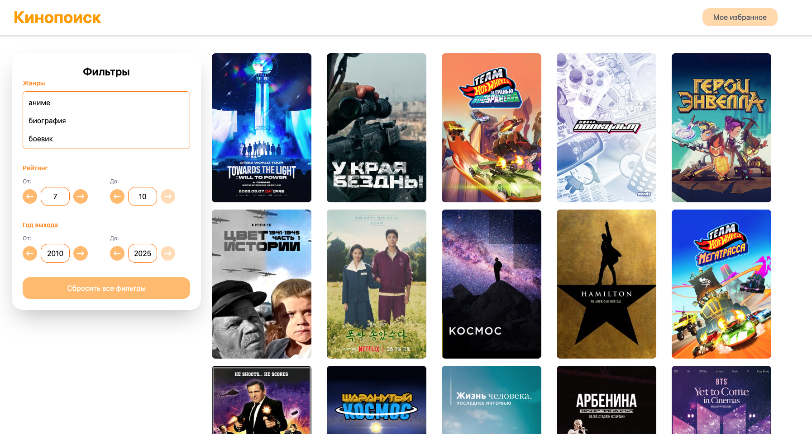
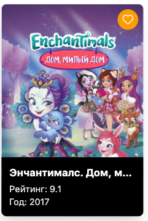
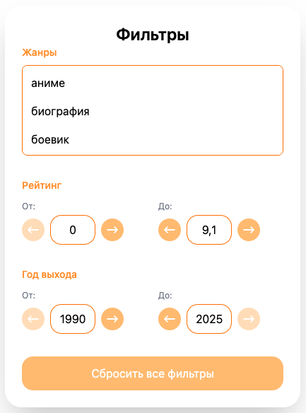
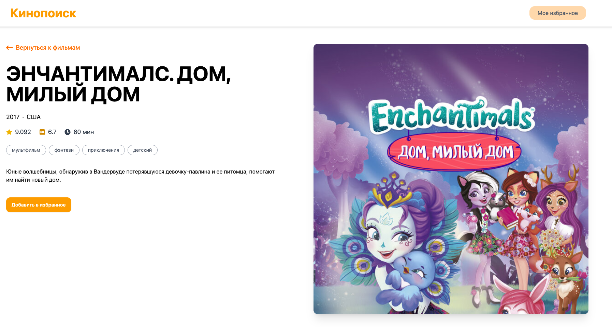
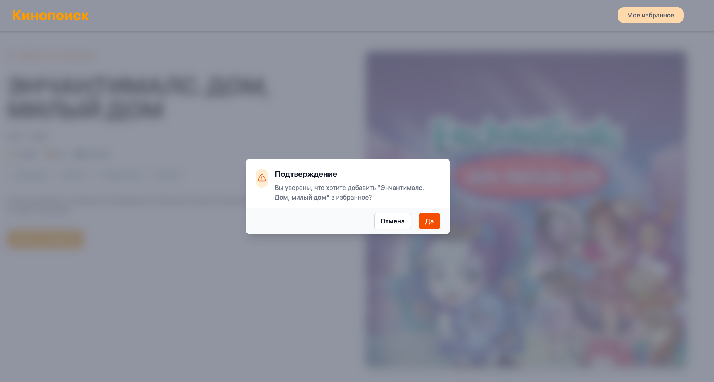
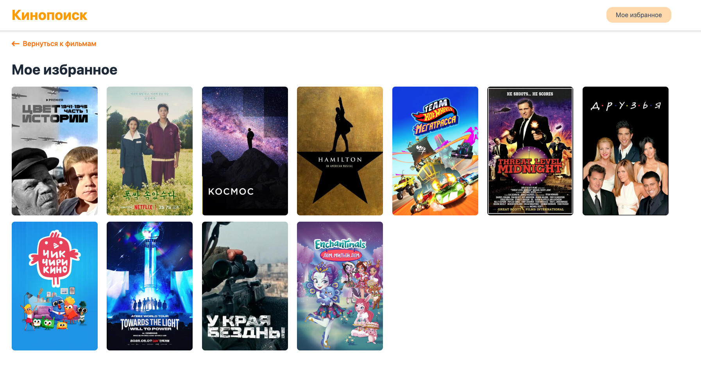

# Movies App

Простое приложение для просмотра информации о фильмах, созданное в рамках тестового задания от ВК.

## Цели проекта

Проект разработан в рамках тестового задания для демонстрации навыков работы с React, TypeScript, MobX и API. Основная цель — создать удобное и современное веб-приложение для просмотра информации, а также фильтрации фильмов с использованием Kinopoisk API, обеспечивая адаптивный интерфейс и функционал избранного.

## Технологии

- React
- TypeScript
- Vite
- Tailwind CSS
- MobX
- Kinopoisk API (https://kinopoisk.dev/)

## Требования

- Node.js: v20.x или выше
- npm: v9.x или выше
- Браузер: Современные версии Chrome, Firefox, Safari или Edge
- API токен от Kinopoisk API (получить через @kinopoiskdev_bot в Telegram)

## Функционал

- Просмотр списка фильмов
- Просмотр детальной информации о фильме
- Возможность добавление фильма в избранное
- Фильтрация по:
  - Жанрам
  - Рейтингу (от и до)
  - Году выпуска (от и до)
- Адаптивный интерфейс

## Установка и запуск

1. Склонируйте репозиторий:

```bash
git clone https://github.com/elizaveta-rybina/kinopoisk-clone
```

2. Установите зависимости:

```bash
npm install
```

3. Настройте окружение:

- Получите API токен в @kinopoiskdev_bot (Telegram)
- Создайте файл `.env` в корне проекта на основе `.env.default`:

```env
VITE_API_KEY=ваш_токен_здесь
```

4. Запустите приложение:

```bash
npm run dev
```

Приложение будет доступно по адресу: [http://localhost:5173](http://localhost:5173)

## Структура проекта

```
/src
  /app          # API взаимодействие
  /entities     # Базовые компоненты
  /features     # Основные фичи приложения
  /pages        # Страницы приложения
  /shared       # Общие компоненты
  /widgets      # Комплексные компоненты
```

## Скриншоты

### Главная страница



### Карточка фильма при наведении



### Фильтрация



### Подробная информация о фильме



### Модальное окно



### Вкладка избранное


